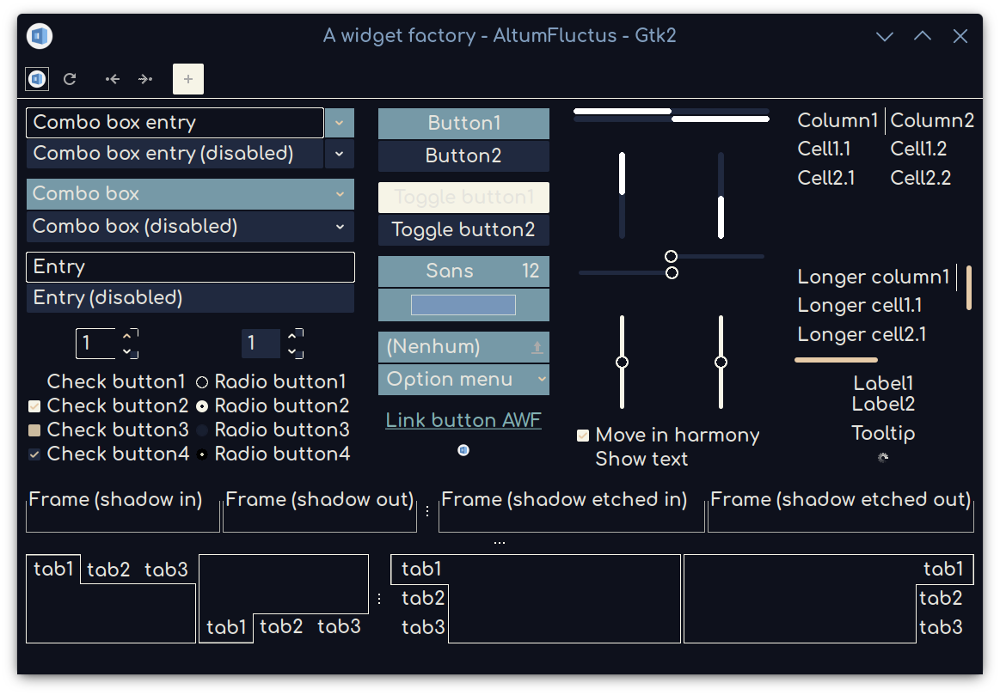
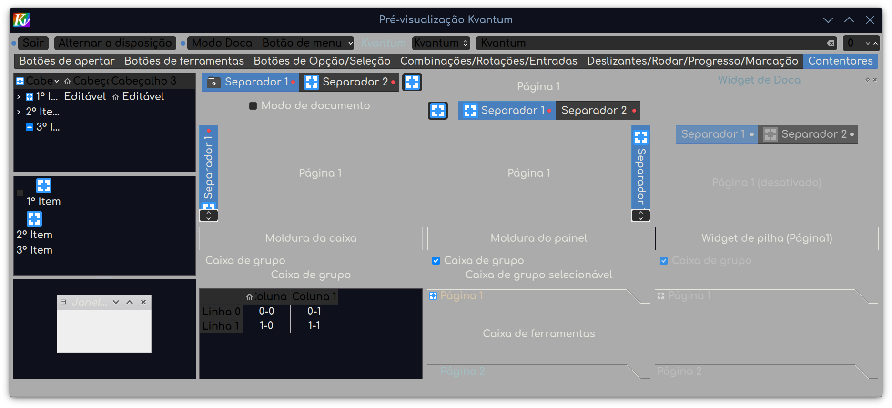
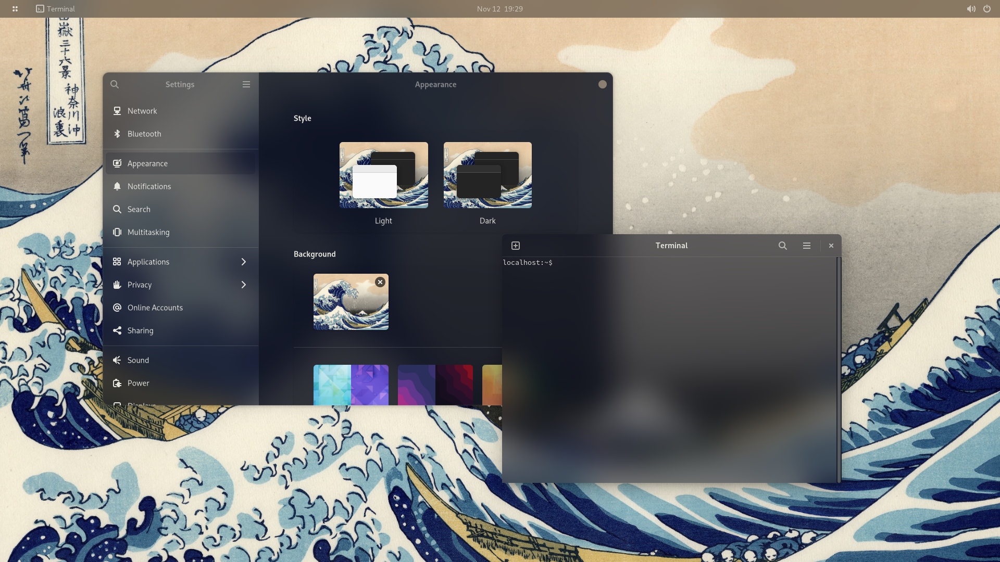

# Altum_Fluctus-Theme
A theme based on the famous painting "The Great Wave of Kanagawa". \
"Altum fluctus" comes from Latin and means "deep waves", making a reference to the painting. The entire theme colorscheme is based on the colors of "The Great Wave of Kanagawa". \
Yet another theme with transparent elements. It's based from the _Cyperaceae_ theme by @ZB652, the _Fluent-gtk-theme_ theme by @vinceliuice and _Akava-Kv_ theme by @Nourepide. \
It works for both _gtk2/3/4_ and _qt(kvantum)_ theme engines. \
This theme also includes a _Konsole_ terminal theme. \
Feel free to add support for any themable program you want. :)

Altum Fluctus _Gtk2_ theme.

Altum Fluctus _Kvantum_ theme.

Altum Fluctus on _Gnome42_ with _BlurMe_ extension.

## Installation
You will need to clone it, then move it to `~/.themes` changing the name to only AltumFluctus, create it if it doesn't exists. Move the _Konsole_ **AltumFluctus.colorscheme** file inside `~/.local/share/konsole/` and remove the folder. After this, move the colorscheme file **AltumFluctus.colors** inside the **Kvantum/** folder to `~/.local/share/color-schemes/`, create it if it doesn't exists. And then move the files from inside the _GTK_ folder to the root folder (**AltumFluctus/**) of the theme, then remove the _GTK_ folder. Also move the **gtk.css** file from inside the **Gnome42/** folder to `~/.config/gtk-4.0`, then remove the folder. I recommend using the _BlurMe_ extension in _Gnome_ or the _mutter-rounded_ and other forks. To set the theme you will also need to install the _gnome-tweaks_ app and to set it on the shell, activate the "User Themes" extension. \
To install the _Kvantum_ theme, don't forget to install  the _Kvantum_ program, move the **Kvantum/** folder renaming to **AltumFluctus** only inside the root folder, then you just need to install it from the GUI, like setting the theme.

## Considerations
Thanks to Andrew, @ZB652, @vinceliuice and to @Nourepide and the other contributors from the _Akava-Design_ project. \
The icon theme used on the screenshots is _Tela-circle-black-dark_, and the font is _Comfortaa_ at 16px of size. The window decoration is the default _Breeze_ theme decoration of _KDE_. The theme might have inconsistencies between different desktops, because the change in rendering, and even, in the logic of elements in each case.
I recommend using "The Great Wave of Kanagawa" 4k as wallpaper.